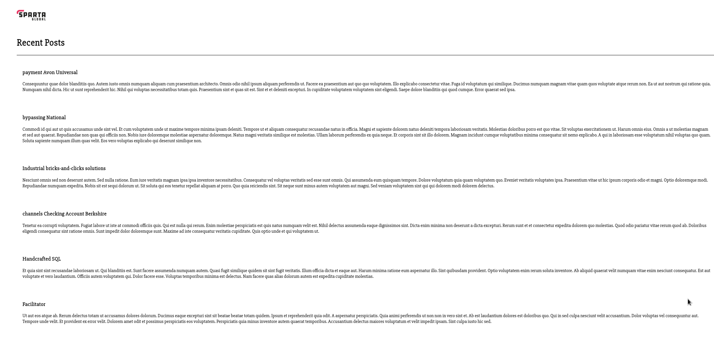

# AWS Provisioning A MongoDB With EC2

## Introduction

A simple provision script to run within a Ubuntu 18.04 instance on an AWS EC2.

## Some Points To Remember

* The security group has to allow the IP of the `app` instance as an inbound rule on port 27017 (unless changed the default)
* The `DB_HOST` attribute is hard-coded into the `aws-provision-app` script in the other EC2 instance, so this will need changing every time it is shut down and rebooted

### Pictures Of /Posts Working

* For some reason, the seeding is working as well, so actual random posts are produced

